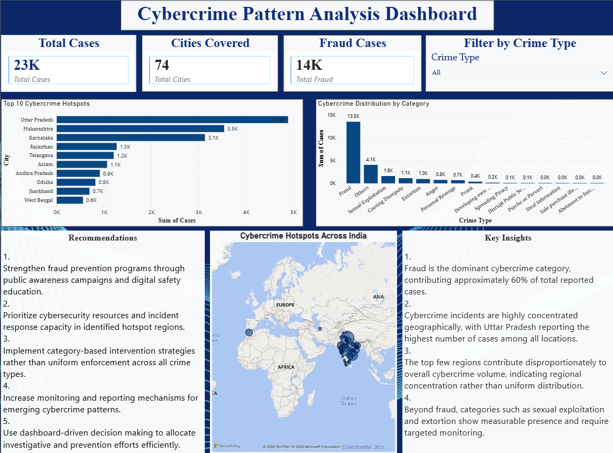

# 🔐 Cybercrime Pattern Analysis — India

> A data analytics project exploring cybercrime trends across Indian states and cities, built to surface actionable insights for law enforcement, policymakers, and public awareness initiatives.

---

## 📌 Project Overview

This project analyzes cybercrime data reported across **74 cities and all major Indian states and Union Territories**, covering multiple years of NCRB (National Crime Records Bureau) records. The goal is to identify crime hotspots, dominant crime categories, and geographic distribution patterns to support data-driven decision-making in cybercrime prevention.

The final deliverable is an **interactive Power BI dashboard** — the *Cybercrime Pattern Analysis Dashboard* — that visualizes over **23,000 total cases** including **14,000+ fraud incidents**.

---

## 📊 Dashboard Preview



---

## 🗂️ Dataset

| Attribute | Details |
|---|---|
| **Source** | National Crime Records Bureau (NCRB), India |
| **Coverage** | All Indian States, Union Territories & Major Cities |
| **Records** | Multi-year data across 74 cities |
| **Format** | CSV |
| **File** | `Dataset_CyberCrime_Sean.csv` |

### Crime Categories Covered

The dataset tracks 15 distinct cybercrime categories:

- Fraud
- Sexual Exploitation
- Extortion
- Causing Disrepute
- Personal Revenge
- Anger
- Prank
- Developing Own Business
- Spreading Piracy
- Disrupt Public Service
- Psycho or Pervert
- Steal Information
- Sale/Purchase of Illegal Drugs
- Abetment to Suicide
- Others

---

## 🔍 Key Findings

### 1. Fraud Dominates All Categories
Fraud is the single largest cybercrime category, accounting for approximately **60% of all reported cases** (~13,500+ cases). This signals a critical need for public-facing fraud prevention programs.

### 2. Geographic Concentration
Cybercrime is not uniformly distributed. The **top 3 states — Uttar Pradesh (~4.9K), Maharashtra (~3.5K), and Karnataka (~3.1K)** — collectively account for a disproportionate share of total incidents.

### 3. Secondary Threats Require Attention
Beyond fraud, **Sexual Exploitation (~1,600 cases)** and **Extortion (~1,100 cases)** show significant and consistent presence across regions, requiring targeted law enforcement intervention.

### 4. Regional Patterns Vary by Crime Type
States like **Assam** show unusually high rates of Personal Revenge and Sexual Exploitation relative to their fraud numbers, indicating that crime profiles differ meaningfully by region — uniform enforcement strategies may be insufficient.

---

## 📁 Project Structure

```
Cybercrime Analysis/
│
├── Dataset/
│   └── Dataset_CyberCrime_Sean.csv     # Raw crime data by state/city
│
├── cyberCrime_analysis.pbix            # Power BI Dashboard file
│
└── Screenshot_2026-05-23_221150.png    # Dashboard preview image
```

---

## 🛠️ Tools & Technologies

| Tool | Purpose |
|---|---|
| **Power BI** | Interactive dashboard design & visualization |
| **Microsoft Excel / CSV** | Data storage and preprocessing |
| **NCRB Data** | Primary data source |

---

## 💡 Recommendations

Based on the analysis, the following actions are recommended:

1. **Strengthen fraud prevention** through public awareness campaigns and digital safety education, particularly in high-volume states.
2. **Prioritize cybersecurity resources** and incident response capacity in identified hotspot regions (UP, Maharashtra, Karnataka).
3. **Implement category-based intervention strategies** rather than uniform enforcement across all crime types.
4. **Increase monitoring and reporting mechanisms** for emerging cybercrime patterns such as sexual exploitation and extortion.
5. **Use dashboard-driven decision making** to allocate investigative and prevention efforts efficiently.

---

## 🚀 How to Use

1. Clone or download this repository.
2. Open `cyberCrime_analysis.pbix` in **Power BI Desktop**.
3. Explore the dashboard using the **Crime Type filter** to drill down by category.
4. Refer to the CSV dataset for raw data analysis or integration with other tools.

> **Note:** Power BI Desktop is free to download from [Microsoft's website](https://powerbi.microsoft.com/desktop/).

---

## 👤 Author

**Sakshi Patel**
Data Analyst | Passionate about turning raw data into meaningful public-interest insights. <br>
📧 [Mail To](sakshinpatel2005@gmail.com) | [Linkedin](https://www.linkedin.com/in/sakshipatel2005/)[GitHub](https://github.com/sakshinpatel)

---

## 📄 License

This project uses publicly available NCRB data for educational and analytical purposes. Please credit appropriately if you build upon this work.

---


